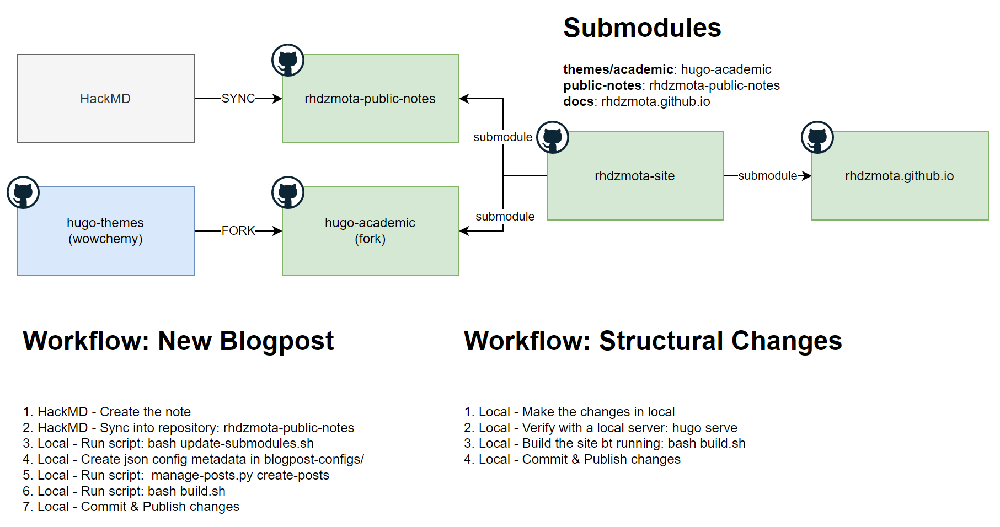

# [RHDZMOTA](https://rhdzmota.com) Site

This site is build with the [Academic Theme] for [Hugo] and the [academic-admin]. 

[Academic Theme]: https://themes.gohugo.io/academic/
[Hugo]: https://gohugo.io/
[academic-admin]:https://github.com/sourcethemes/academic-admin



## Setup

Use [this blogpost](https://rhdzmota.com/post/creating-your-own-site-with-academic-hugo/) to install Academic Hugo into your local system. Or just copy and paste: 

```commandline
$ sudo apt install wget && \
    wget -O hugo.deb 'https://github.com/gohugoio/hugo/releases/download/v0.104.3/hugo_extended_0.104.3_linux-amd64.deb' && \
    sudo dpkg -i hugo.deb
```

Clone this repository with submodules: 

```commandline
$ git clone --recurse-submodules git@github.com:RHDZMOTA/rhdzmota-site.git
```

Test with a local development server:

```commandline
$ hugo serve
```

## Publishing

The `docs/` directory contains the static content to publish into github pages. It's configured as a git submodule. You can rebuild the site by running: 

```commandline
$ hugo
```

Or use the build script with: `bash build.sh`

Using the build-script automates the submodule management and pushes directly to github-pages branch. You'll still have to add/commit your code for this repository.

Add/commit changes and upload the content by just pushing into master in both the base-project and the submodule. 

```commandline
$ git push --recurse-submodules=on-demand
```

## Register a new hackmd blogpost

Once the hackmd blogpost is already in sync with the rhdzmota-public-notes repo, execute the following command
to download the latest changes:

```commandline
$ bash update-submodules.sh
```

Create the configuration files on `blogpost_configs`. Note that the configuration filename should match with the
`public-notes` post filename. Once this is done, activate your virtualenv and execute:

```commandline
$ python manage-posts.py create-posts
```

Great! You should be good to go. Follow the `publishing` instructions to get your changes to the webpage.
