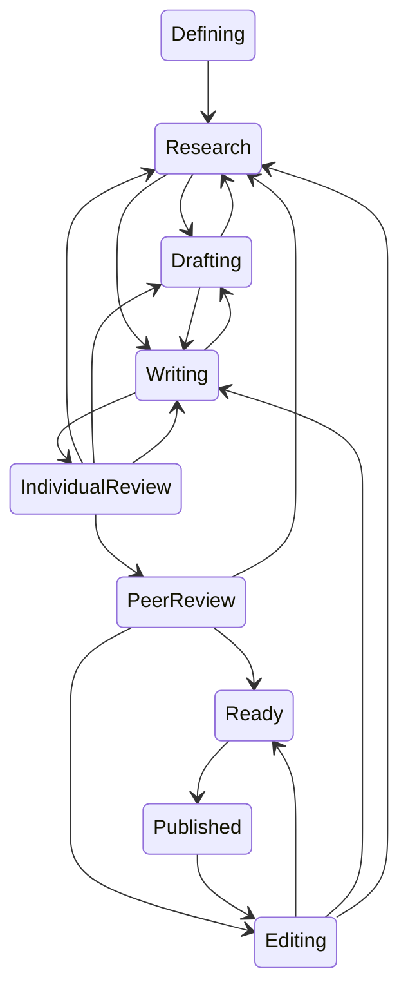

# Blog Register

Status options:
* Defining
* Research
* Drafting
* Writing
* IndividualReview
* PeerReview
* Editing
* Ready
* Published

## [DOCS-0](https://hackmd.io/5Q-MyBg3QKSKch9Th634qw)
* Status: Published
* Title: Blog Register
* Directory:
* PATH: .
* URL: https://hackmd.io/5Q-MyBg3QKSKch9Th634qw

## [DOCS-1](https://hackmd.io/2JlcI0DLSdGCGpmCdMcLOA)
* Status: Published
* Title: Creating your own site with Academic Hugo
* Directory: creating-your-own-site-with-academic-hugo
* Base Path: rhdzmota-site/content/post
* URL: https://hackmd.io/2JlcI0DLSdGCGpmCdMcLOA

## [DOCS-2](https://hackmd.io/6sYYZnzFQe6xUd0Y-RGYMg)
* Status: Defining
* Title: The importance of writing
* Directory: how-to-write-and-why-to-care-about-it
* Base Path: rhdzmota-site/content/post
* URL: https://hackmd.io/6sYYZnzFQe6xUd0Y-RGYMg

## [DOCS-3](https://hackmd.io/eMsjVnw1Rv-32794UF3B9w)
* Status: Defining
* Title: My writing process
* Directory: my-writing-process
* Base Path: rhdzmota-site/content/post
* URL: https://hackmd.io/eMsjVnw1Rv-32794UF3B9w
