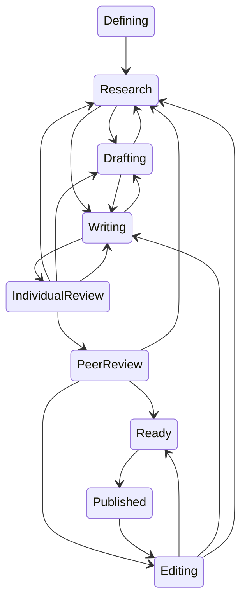

Let's see if hugo can render some diagrams:

```mermaid
stateDiagram
    Defining --> Research
    Research --> Drafting
    Research --> Writing
    Drafting --> Writing
    Drafting --> Research
    Writing --> IndividualReview
    Writing --> Drafting
    IndividualReview --> PeerReview
    IndividualReview --> Research
    IndividualReview --> Drafting
    IndividualReview --> Writing
    PeerReview --> Ready
    PeerReview --> Research
    PeerReview --> Editing
    Editing --> Ready
    Editing --> Writing
    Editing --> Research
    Ready --> Published
    Published --> Editing
    
```

```mermaid
graph TD;
  A-->B;
  A-->C;
  B-->D;
  C-->D;
```

